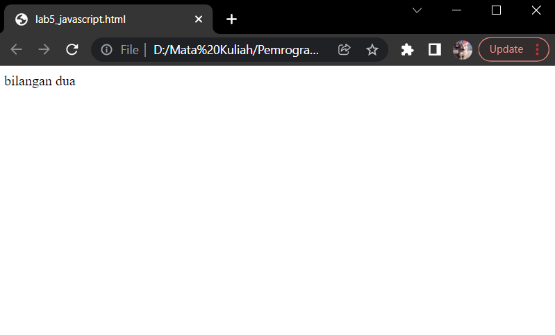

# Latihan Javascript

* Nama          : Hizbullah Ridwan
* NIM           : 312110055
* Kelas         : TI.21.B.1
* Mata Kuliah   : Pemrograman Web

Dalam latihan javascript ini, saya menggunakan [Google Chrome](https://www.google.com/intl/id_id/chrome/) sebagai web browser dan [visual studio code](https://code.visualstudio.com/) sebagai teks editornya.       

## Javascript Dasar

Buat file HTML baru kemudian isi seperti ini :          

```bash
<!DOCTYPE html>
<html>
    <head>
        <title>Mengenal Javascript</title>
    </head>
    <body>
        <h1>Pengenalan Javascript</h1>
        <h3>Contoh document.write dan console.log</h3>
        <script>
            document.write("Hello World");
            console.log("Hello World");
        </script>
    </body>
</html>
```         

       

## Alert

Alert berfungsi untuk menampilkan pesan pada saat file tersebut dibuka.            


```bash
<!DOCTYPE html>
<html>
    <head>
        <title>Alert Box</title>
    </head>
    <body>
        <script language = "javascript">
            window.alert("Ini merupakan pesan untuk anda");
        </script>
    </body>
</html>
```         

       

## Pemakaian Method Dalam Objek

Untuk pemakaian method dalam objek, contohnya adalah seperti ini :         

```bash
<!DOCTYPE html>
<html>
    <head>
        <title>Skrip javascript</title>
    </head>
    <body>
        Percobaan memakai javascript :<br>
        <script language = "javascript">
            document.write("Selamat mencoba javaascript<br>");
            document.write("Semoga Sukses");
        </script>
    </body>
</html>
```         

        

## pemakaian Prompt

Prompt digunakan untuk melakukan input didalam website melalui javascript. Isi form nama       
kemudian klik oke maka hasilnya akan terlihat seperti ini :           

```bash
<!DOCTYPE html>
<html>
    <head>
        <title>pemasukan Data</title>
    </head>
    <body>
        Percobaan memakai javascript :<br>
        <script language = "javascript">
            var nama = prompt("Siapa nama anda?","Masukkan nama anda");
            document.write("hai "+nama);
        </script>
    </body>
</html>
```         

        

        

## Fungsi

Untuk menggunakan fungsi pada javascript, caranya adalah masukkan fungsi kedalam tag `<script>`          
Kemudian salah satu cara untuk memanggilnya yaitu dengan menggunakan atribut `onload` pada tag `<body>`.          

```bash
<!DOCTYPE html>
<html>
    <head>
        <title>Contoh Program Javascript</title>
    </head>
    <script language = "javascript">
        function pesan() {
            alert ("memanggil javascript lewat body onload")
        }
    </script>
    <body onload=pesan()>
    </body>
</html>
```         

        

## Operasi Dasar Aritmatika

```bash
<!DOCTYPE html>
<html>
    <head>
        <title>Contoh Program Javascript</title>
    </head>
    <script language = "javascript">
        function test (val1,val2) {
            document.write("<br>"+"perkalian : val1*val2"+"<br>")
            document.write(val1*val2)
            document.write("<br>"+"pembagian : val1/val2"+"<br>")
            document.write(val1/val2)
            document.write("<br>"+"penjumlahan : val1+val2"+"<br>")
            document.write(val1+val2)
            document.write("<br>"+"pengurangan : val1-val2"+"<br>")
            document.write(val1-val2)
            document.write("<br>"+"modulus : val1%val2"+"<br>")
            document.write(val1%val2)
        }
    </script>
    <body>
        <input type="button" name="button1" value="arithmetic" onclick=test(9,4)>
    </body>
</html>
```           

          

          

## Seleksi Kondisi

Contoh untuk melakukan seleksi kondisi (if-else) adalah seperti ini :            

```bash
<!DOCTYPE html>
<html>
    <head>
        <title>Contoh if-else</title>
    </head>
    <script language = "javascript">
        var nilai = prompt("nilai (0-100): ", 0);
        var hasil = "";
        if (nilai => 60)
            hasil = "lulus";
        else
            hasil = "tidak lulus";
        document.write("hasil: " + hasil);
    </script>
    <body>
    </body>
</html>
```           

          

          

## Switch untuk Seleksi Kondisi

Selain menggunakan if-else, seleksi kondisi juga bisa dilakukan dengan menggunakan        
switch. Contohnya adalah seperti ini :             

```bash
<!DOCTYPE html>
<html>
    <head>
        <script language = "javascript">
        function
        </script>
    </head>
    <body>
        <input type="button" name="button1" value="switch" onclick=test()>
    </body>
</html>
```           

          

          

## Form Input

Untuk membuat form input menggunakan javascript contohnya adalah seperti ini :            

```bash
<!DOCTYPE html>
<html>
    <head>
        <script language = "javascript">
            function test() {
                var val1 = document.kirim.T1.value
                if (val1%2==0)
                    document.kirim.T2.value="bilangan genap"
                else
                    document.kirim.T2.value="bilangan ganjil"
            }
        </script>
    </head>
    <body>
        <form method="POST" name="kirim">
            <p>
                BIL <input type="text" name="T1" size="20">
                MERUPAKAN BIL <input type="text" name="T2" size="20">
            </p>
            <p>
                <input type="button" value="tebak" name="B1" onclick="test()">
            </p>
        </form>
    </body>
</html>
```           

          

## Form Button

Form button contohnya adalah seperti ini :            

```bash
<!DOCTYPE html>
<html>
    <head>
        <title>
            Objek Dokumen
        </title>
    </head>
    <body>
        <script language = "javascript">
            function ubahWarnaLB(warna) {
                document.bgColor = warna;
            }
            function ubahWarnaLD(warna) {
                document.fgColor = warna;
            }
        </script>
        <h1>tes</h1>
        <form>
            <input type="button" value="Latar belakang hijau" onClick="ubahWarnaLB('GREEN')">
            <input type="button" value="Latar belakang putih" onClick="ubahWarnaLB('WHITE')">
            <input type="button" value="Teks kuning" onClick="ubahWarnaLD('YELLOW')">
            <input type="button" value="Teks biru" onClick="ubahWarnaLD('BLUE')">
        </form>
        <script language="javascript">
            document.write("Dimodifikasi terakhir pada " + document.lastModified);
        </script>
    </body>
</html>
```           

          

          